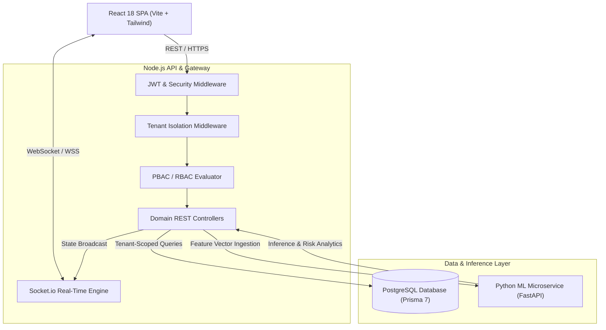
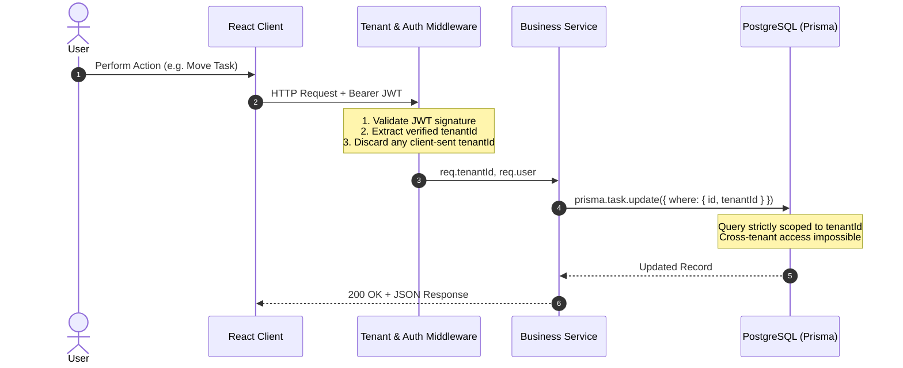
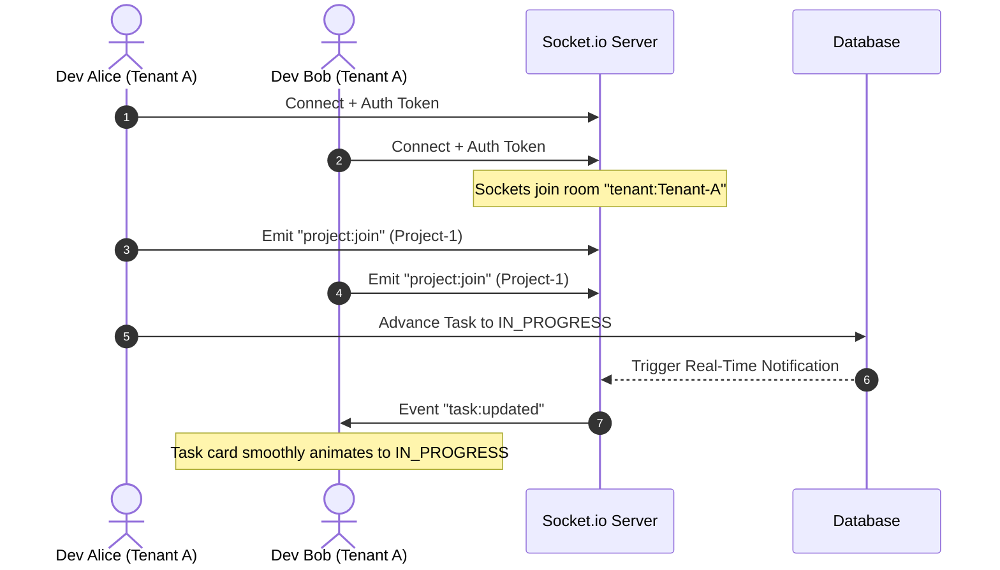
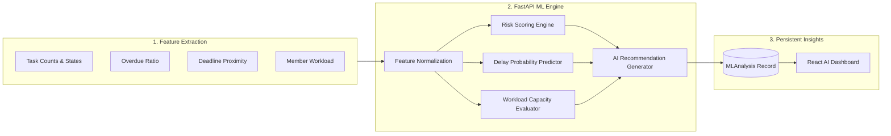

# System Architecture & Technical Design
## Secure Multi-Tenant Project Management Platform with Real-Time Analytics

---

### 1. High-Level Architecture

The platform adopts a decoupled service-oriented architecture:

---

### 2. Multi-Tenant Security & Isolation Model

Tenant isolation is guaranteed by strict server-side boundary enforcement:

---

### 3. Real-Time Collaboration Flow

---

### 4. Machine Learning Project Intelligence Pipeline

---

### 5. Deployment Topology

The platform supports containerized and standalone deployments:
- **Frontend**: Static SPA hosted via Vercel, Netlify, or Nginx.
- **Backend**: Node.js container (Port `5000`) with horizontal autoscaling.
- **ML Service**: Python Uvicorn container (Port `8000`).
- **Persistence**: Managed PostgreSQL 15+ instance with connection pooling.
