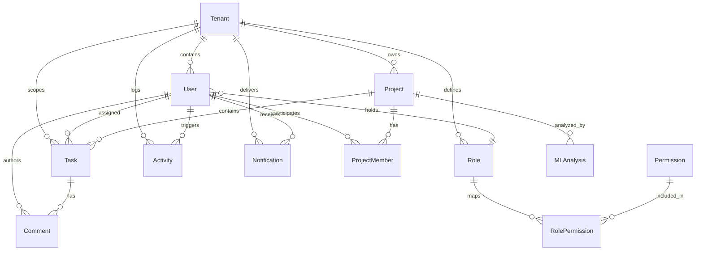

# Database Design & Tenancy Schema
## Secure Multi-Tenant Project Management Platform with Real-Time Analytics

---

### 1. Entity-Relationship Diagram (ERD)

---

### 2. Table Specifications & Tenancy Scoping Strategy

#### 2.1 `Tenant`
Primary organizational entity defining the logical data boundary.
- `id` (UUID, Primary Key)
- `name` (VARCHAR, Organization display name)
- `slug` (VARCHAR, Unique slug for routing / vanity URL)
- `status` (VARCHAR, `active`, `suspended`)
- `createdAt`, `updatedAt` (TIMESTAMPTZ)

#### 2.2 `User`
Organization members belonging to a single tenant.
- `id` (UUID, Primary Key)
- `name` (VARCHAR)
- `email` (VARCHAR, Unique)
- `passwordHash` (VARCHAR, Bcrypt hash $\ge 12$ rounds)
- `status` (VARCHAR, `active`, `inactive`)
- `tenantId` (UUID, Foreign Key $\to$ `Tenant.id`, Indexed)
- `roleId` (UUID, Foreign Key $\to$ `Role.id`)

#### 2.3 `Role` & `Permission`
Tenant-scoped Role-Based Access Control model.
- `Role`: `id`, `name`, `description`, `tenantId` (Composite Unique: `[tenantId, name]`).
- `Permission`: `id`, `name` (Unique system-wide), `description`.
- `RolePermission`: `roleId`, `permissionId` (Composite Primary Key).

#### 2.4 `Project` & `ProjectMember`
- `Project`: `id`, `name`, `description`, `status`, `priority` (`LOW`, `MEDIUM`, `HIGH`, `URGENT`), `startDate`, `endDate`, `tenantId` (Indexed).
- `ProjectMember`: `id`, `projectId`, `userId`, `role` (`MANAGER`, `MEMBER`, `VIEWER`), Unique constraint on `[projectId, userId]`.

#### 2.5 `Task`
- `id` (UUID, Primary Key)
- `title` (VARCHAR, Required)
- `description` (TEXT)
- `status` (VARCHAR, `TODO`, `IN_PROGRESS`, `IN_REVIEW`, `COMPLETED`)
- `priority` (VARCHAR, `LOW`, `MEDIUM`, `HIGH`, `URGENT`)
- `dueDate` (TIMESTAMPTZ, Optional)
- `estimatedHours` (FLOAT), `actualHours` (FLOAT)
- `projectId` (UUID, Foreign Key $\to$ `Project.id`)
- `assigneeId` (UUID, Foreign Key $\to$ `User.id`, Nullable)
- `tenantId` (UUID, Foreign Key $\to$ `Tenant.id`, Indexed)

#### 2.6 `Comment`
- `id` (UUID, Primary Key)
- `content` (TEXT)
- `taskId` (UUID, Foreign Key $\to$ `Task.id`)
- `userId` (UUID, Foreign Key $\to$ `User.id`)

#### 2.7 `Activity`
Immutable audit log tracking organizational operations.
- `id` (UUID, Primary Key)
- `action` (VARCHAR, e.g. `TASK_CREATED`, `PROJECT_UPDATED`)
- `details` (TEXT)
- `entityType` (VARCHAR, `TASK`, `PROJECT`, `USER`, `TENANT`)
- `entityId` (VARCHAR)
- `userId` (UUID, Foreign Key $\to$ `User.id`, Nullable)
- `tenantId` (UUID, Foreign Key $\to$ `Tenant.id`, Indexed)

#### 2.8 `Notification`
- `id` (UUID), `title` (VARCHAR), `message` (TEXT), `isRead` (BOOLEAN), `userId` (UUID), `tenantId` (UUID).

#### 2.9 `MLAnalysis`
Predictive snapshots generated by the Python ML microservice.
- `id` (UUID, Primary Key)
- `projectId` (UUID, Foreign Key $\to$ `Project.id`)
- `riskScore` (FLOAT, 0-100)
- `riskLevel` (VARCHAR, `LOW`, `MEDIUM`, `HIGH`)
- `delayProbability` (FLOAT, 0.00-1.00)
- `workloadIndex` (FLOAT)
- `recommendations` (TEXT)
- `createdAt` (TIMESTAMPTZ)

---

### 3. Indexing & Query Isolation Rules

1. **Foreign Key Indexing**: Every table referencing `tenantId` carries a B-Tree index on `tenantId` (`@@index([tenantId])`).
2. **Scope Constraint**: No query across `Project`, `Task`, `Activity`, `User`, or `Notification` executes without filtering by `tenantId`.
3. **Cascade Rules**: Deletion of a `Tenant` safely triggers cascaded removal of all organizational records.
